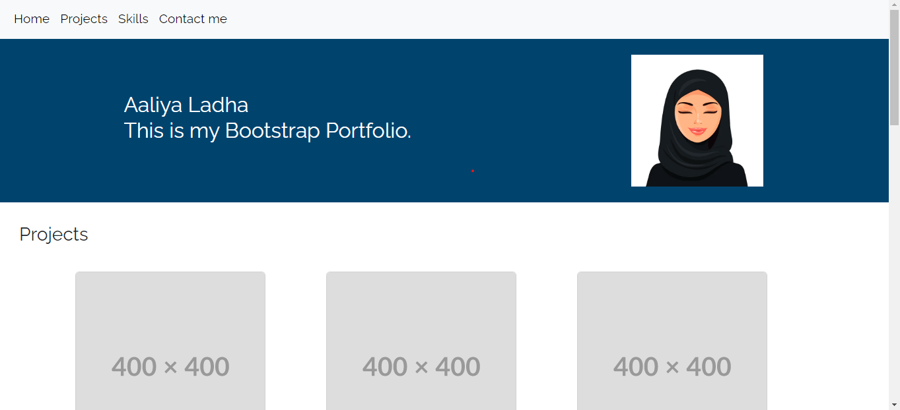

# Bootstrap-Portfolio

## Title
edX Bootcamp Module 3 Homework: UX and Advanced CSS: Bootstrap Portfolio

## Creating a bootstrap professional portfolio.

## Tools used:
HTML,
CSS,
GitHub,
Bootstrap 4.6.2,
Bootstrap 5.3.0

## Deployed Application Link

## Screenshot of deployed application 

## Credits 
Bootstrap 4.6.2
Boostrap 5.3.0